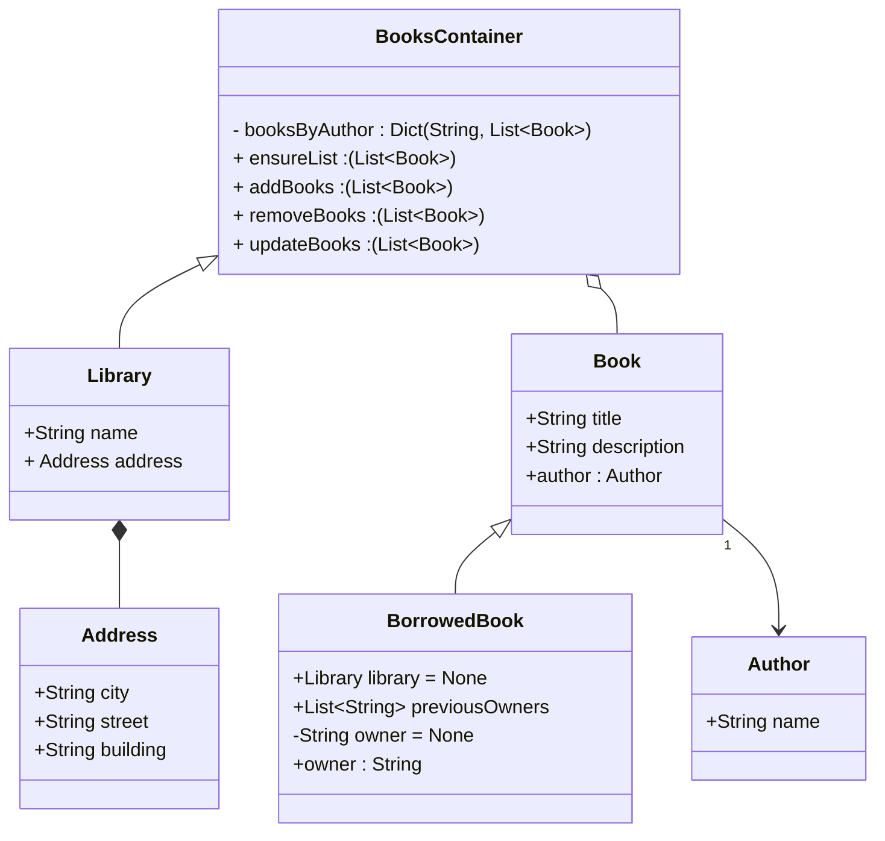

```mermaid
classDiagram
    class BooksContainer{
        - booksByAuthor : Dict (String, List~Book~)
        + ensureList : (List~Book~)
        + addBooks : (List~Book~)
        + removeBooks : (List~Book~)
        + updateBooks : (List~Book~) 
    }
    class Library{
        +String name
        + Address address
    }
    class Address{
        +String city
        +String street
        +String building
    }
    class Author{
        +String name
    }
    class Book{
        +String title
        +String description
        +author : Author
    }
    class BorrowedBook{
        +Library library = None
        +List~String~ previousOwners
        -String owner = None
        +owner : String
    }
    
    BooksContainer <|-- Library 
    Library *-- Address

    BooksContainer o-- Book
    Book <|-- BorrowedBook
    Book "1" --> Author

```